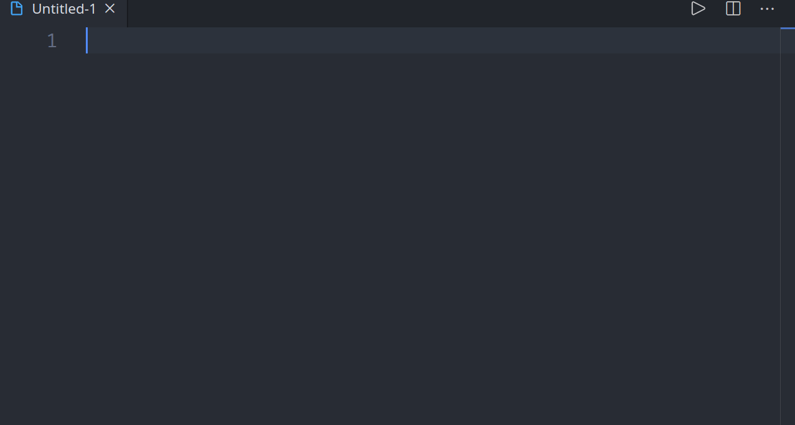
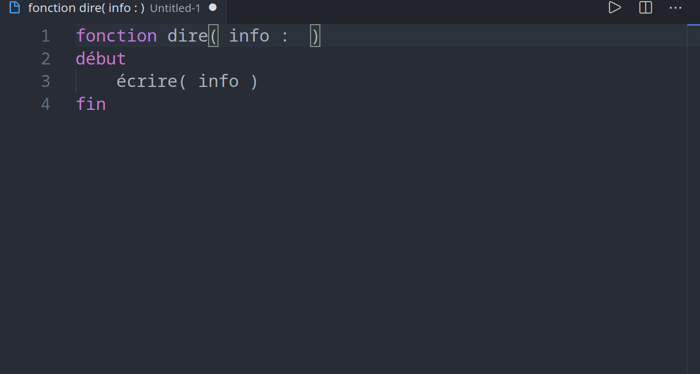
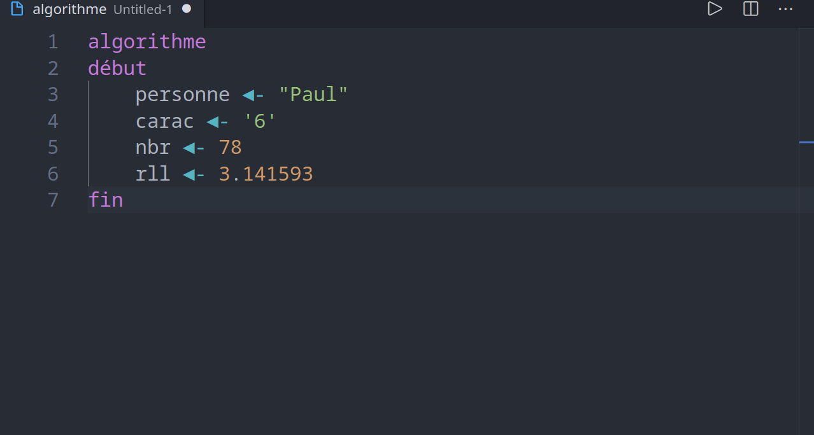

# [Français] extension Algo pour l'IUT Charlemagne

**Note:** Toujours en développement !

Cette extension ajoute:
  - Des raccourcis (snippets) pour coder plus vite
  - Une colorisation des mots clés pour y voir plus clair
  - Des outils pour exécuter l'algorithme, générer le lexique, ...

# [English] Algo extension for Charlemagne IT Departement
*(thanks to my english teacher, by the way)*

**Note:** Still in development !

This extension provides:
  - Snippets to code faster
  - Keyword colorization to help reading the code
  - Tools to execute the algorithme, generate lexicon, ...

Author: Paulux \[
[WebSite](https://paulux06.github.io) |
[Twitter](https://twitter.com/paulux06) |
[YouTube](https://www.youtube.com/channel/UCt9MIbQT2fub0_vHa8hTkuw) |
[Instagram](https://www.instagram.com/paulux06polux) \]